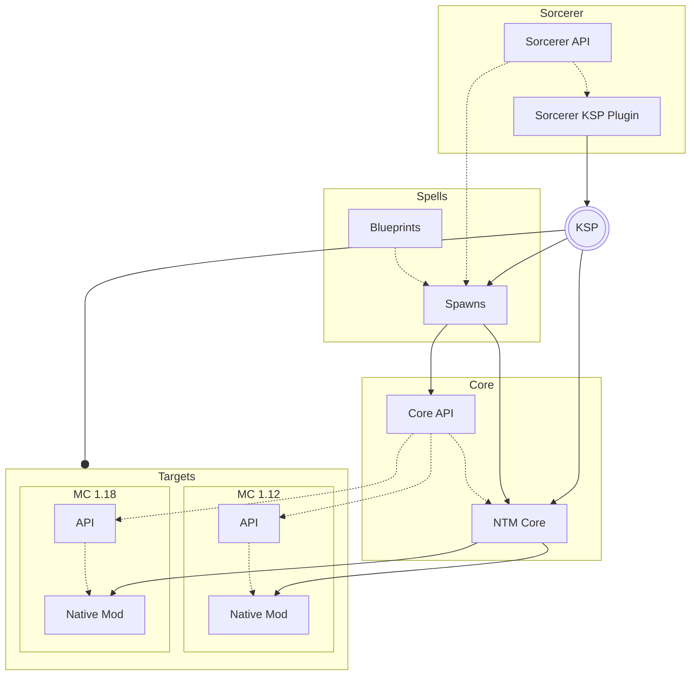

<!--
SPDX-FileCopyrightText: 2023-2024 MartinTheDragon <martin@ntmr.dev>
SPDX-License-Identifier: GFDL-1.3-or-later

Permission is granted to copy, distribute and/or modify this document under the terms of the GNU Free Documentation License, Version 1.3 or any later version published by the Free Software Foundation;
with no Invariant Sections, no Front-Cover Texts, and no Back-Cover Texts.
A copy of the license is included in the LICENSES directory of this project's root directory.
-->

## Project Structure

Whether you noticed or not, this project is organized in a quite more complex way than your usual mod.
In particular, it uses a custom piece of technology, named "Sorcerer", to facilitate multi-version development.
This led to the project being split into several subprojects that depend on one another.
Here's a flowchart of the current project structure. Further below you can find detailed descriptions of each subproject.

### Sorcerer

The custom tool that makes multi-version development feasible, Sorcerer is a plugin for the
[Kotlin Symbol Processing](https://kotlinlang.org/docs/ksp-overview.html) compiler plugin, KSP for short.
It performs a great deal of code generation in order to create a common API for multi-version modding, which
would otherwise have to be done manually.

Sorcerer is split into an API source set, meant to be used by other subprojects in-code, and a KSP plugin source
set, which is exclusively used by KSP.

KSP then runs Sorcerer across several other subprojects, performing different kinds of tasks to generate code and
glue everything together.

### Spells

Continuing with the theme of magic, the Spells subproject contains interfaces that represent different Minecraft
vanilla classes of a specific version. This version is set in the project build settings and tells Sorcerer
what the common generated API should closely resemble. Only versions for which a *Linkage* declaration exists
on all interfaces and functions may be chosen.

While some interfaces are really just representations of vanilla interfaces, most of them are actually
blueprints/spells. Although these blueprints are also just interfaces syntactically, they represent vanilla classes and hold
the necessary details for Sorcerer to generate *Assimilation Classes*, which act as sort of wrappers around the vanilla
classes, so they can be used in common code. Using them works just like writing normal Minecraft mod code, as they
assimilate/mimic corresponding vanilla functions. Sorcerer additionally generates API stubs for the Assimilation Classes
and tries to automatically implement them on target versions. They're the actual glue.

### Core

Defined in the Core is the common mod code that gets compiled to all target versions. It depends on the Spawns generated
in the Spells subproject and defines all mod features that should be the same for all Minecraft versions.

Representing a mod just like any other, it is split into an API, that could theoretically be used by other mods using
Sorcerer on the same Minecraft API version, and the main source set, that contains the main functionality of the mod.

### Targets

Lastly, the Core gets compiled to several target versions with Sorcerer performing the finishing touches, gluing the Core
to the individual Minecraft version, along with some version-specific features, and out go mods that can be installed as
usual.

Sorcerer also generates version-specific mod APIs out of the Core API, which can be used by other mods not using Sorcerer.
